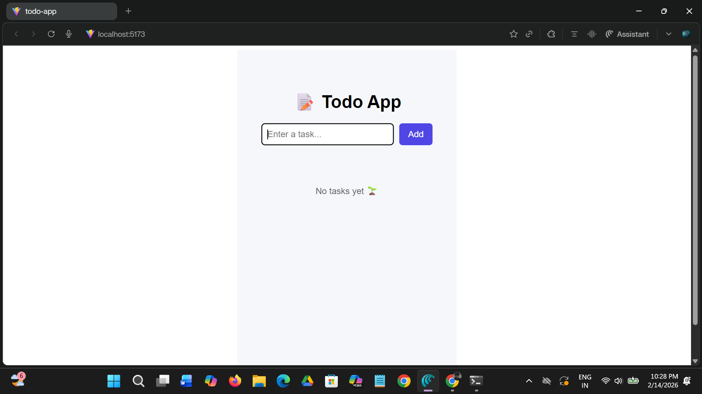
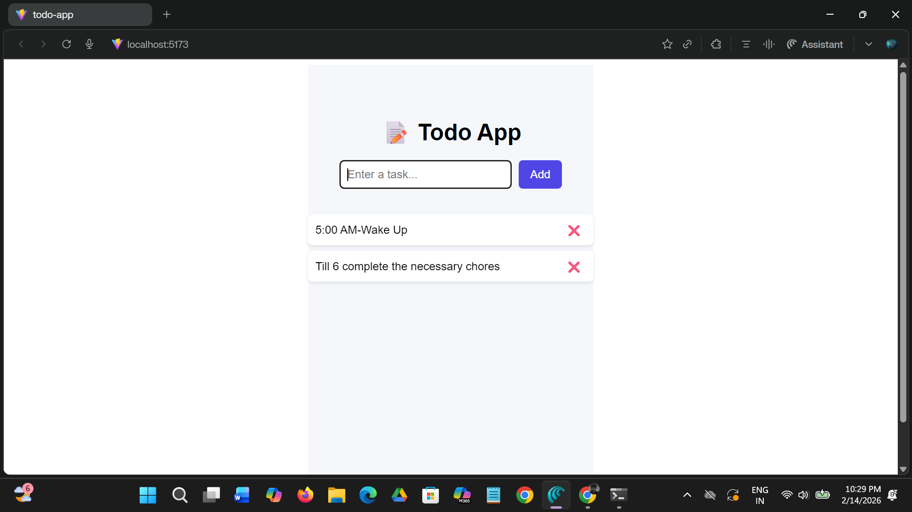

# React Todo App 📝

This is a simple React Todo application created using functional components and the `useState` hook.

## 🚀 Features
- Add new todos
- Display list of todos dynamically
- Simple and clean UI
- Built using React Hooks

## 🛠️ Tech Stack
- React
- JavaScript
- HTML
- CSS

## 📸 Screenshots

### Empty Todo List


### Todos Added



## 📂 How to Run Locally
```bash
npm install
npm run dev
